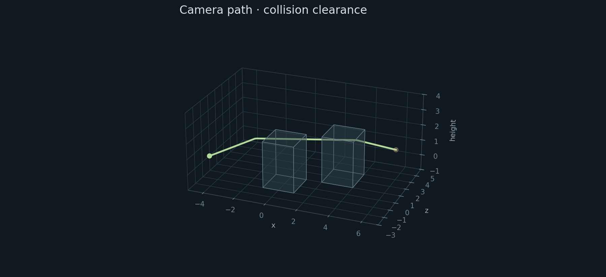

# sengine

Small C++23 engine. Filament rendering, SDL3 windows, drawing, terrain collision and first-person cameras.



Used by [little world](https://github.com/ImArjunJ/little-world).

```sh
./tools/fetch_filament.sh
cmake -S . -B build -DCMAKE_TOOLCHAIN_FILE=cmake/clang_libcxx.cmake
cmake --build build
```

Linux needs Clang with libc++, SDL3 3.2+, FreeType and libpng. Set `filament_root` for an existing Filament 1.77.1 SDK. The Metal backend is unverified.

Use `sengine::sengine` through `add_subdirectory` or an installed CMake package. `sengine_graphics=OFF` builds just collision, input state and cameras.
