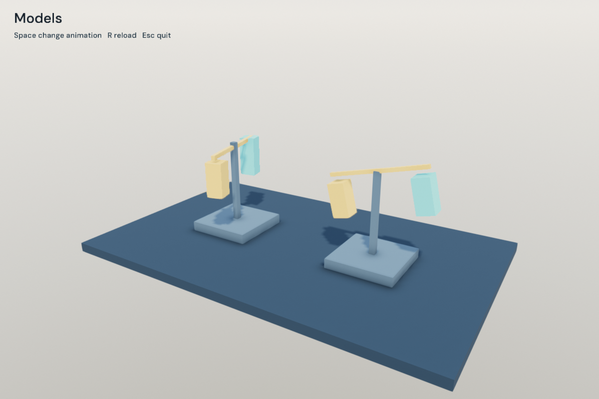

# sengine

A C++23 game engine with a backend-neutral API.



- Scene lifecycles, fixed updates, input routing and frame pacing.
- Entity worlds, scene files, prefabs and owned model instances.
- Rigid bodies, characters, collision layers, triggers and spatial queries.
- Jobs, typed assets, asynchronous loading and reloads.
- Skeletal animation, morphs, crossfades, PBR rendering and audio.

```sh
./tools/fetch_filament.sh
cmake -S . -B build -DCMAKE_TOOLCHAIN_FILE=cmake/clang_libcxx.cmake
cmake --build build
./build/sengine_models
```

Space changes animation, R reloads. [Models](examples/models.cpp) loads two instances from one prefab. Edit `build/data/models` while running. [Physics](examples/physics.cpp) demonstrates bodies and character movement.

Choose `sengine_window_backend=sdl` or `glfw`, and `sengine_graphics_api=opengl`, `vulkan` or `metal`. Defaults are SDL and OpenGL on Linux, SDL and Metal on macOS. Rendering uses Filament, audio uses SDL, physics uses Jolt. Public headers expose none of them.

Needs Clang with libc++, SDL3 3.2+, FreeType and libpng; GLFW builds also need GLFW 3.3+. Set `filament_root` for an existing Filament 1.77.1 SDK. CMake fetches Jolt 5.6.0; `sengine_physics=OFF` excludes it.

For the core alone:

```sh
cmake -S . -B build-core -Dsengine_graphics=OFF
cmake --build build-core
./build-core/sengine_falling
./build-core/sengine_scenes
```

Link `sengine::sengine` through `add_subdirectory` or an installed CMake package. CMake exports compile commands.

Scenes use versioned JSON and explicit [component schemas](examples/scenes.cpp). Prefab references are local; `/` references the root scene. `capture()` saves a standalone snapshot. Load replacements before releasing the current scene.

`world_renderer::advance()` synchronizes model transforms, visibility and animation. Model parts select nodes by name or source index; child visibility follows its ancestors. Reloads prepare replacements before releasing existing instances. Instance storage is reused until its model is released. Morph instances keep separate GPU resources.

Call `physics_world::step()` at its configured fixed interval. Characters use Y-up gravity; spheres and capsules need uniform scale.

Keep borrowed windows, renderers, scenes and worlds alive through their dependents. Material copies retain their source model. World, model and physics calls stay on the owning thread. Scene transitions apply next frame; `fixed_input()` retains taps until a fixed update.
