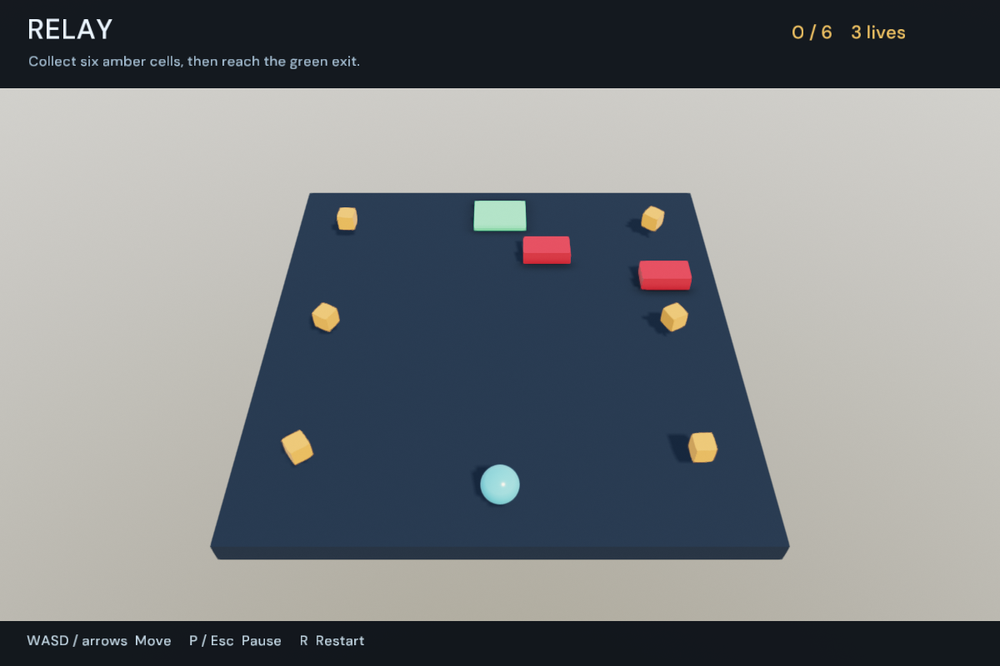

# sengine

A C++23 game engine with a backend-neutral API.



- Scene lifecycles, fixed updates, input routing and frame pacing.
- Entity worlds, transform hierarchies and synchronized meshes.
- Jobs, typed assets, asynchronous loading and reloads.
- Animation, procedural geometry, glTF scenes and PBR rendering.
- Audio, text, images and immediate-mode drawing.

```sh
./tools/fetch_filament.sh
cmake -S . -B build -DCMAKE_TOOLCHAIN_FILE=cmake/clang_libcxx.cmake
cmake --build build
./build/sengine_relay
```

Relay is a small collection game. The [example](examples/relay.cpp) covers scene transitions, pause/resume, input actions and world rendering.

Choose `sengine_window_backend=sdl` or `glfw`, and `sengine_graphics_api=opengl`, `vulkan` or `metal`. Defaults are SDL and OpenGL on Linux, SDL and Metal on macOS. Rendering uses Filament; audio uses SDL. Public headers expose neither.

Needs Clang with libc++, SDL3 3.2+, FreeType and libpng. GLFW builds also need GLFW 3.3+. Set `filament_root` for an existing Filament 1.77.1 SDK. Materials are compiled with its `matc` tool.

For the core alone:

```sh
cmake -S . -B build-core -Dsengine_graphics=OFF
cmake --build build-core
./build-core/sengine_orbit
```

Link `sengine::sengine` through `add_subdirectory` or an installed CMake package. CMake exports compile commands.

Scene transitions apply next frame. `fixed_input()` retains taps until a fixed update. Only the active scene receives input and updates; suspended scenes keep their resources.

Keep borrowed windows, renderers, scenes and worlds alive through their dependents. World changes and asset commits stay on the owning thread. Canvas drawing needs an `activate()` binding; job pools drain on destruction.
