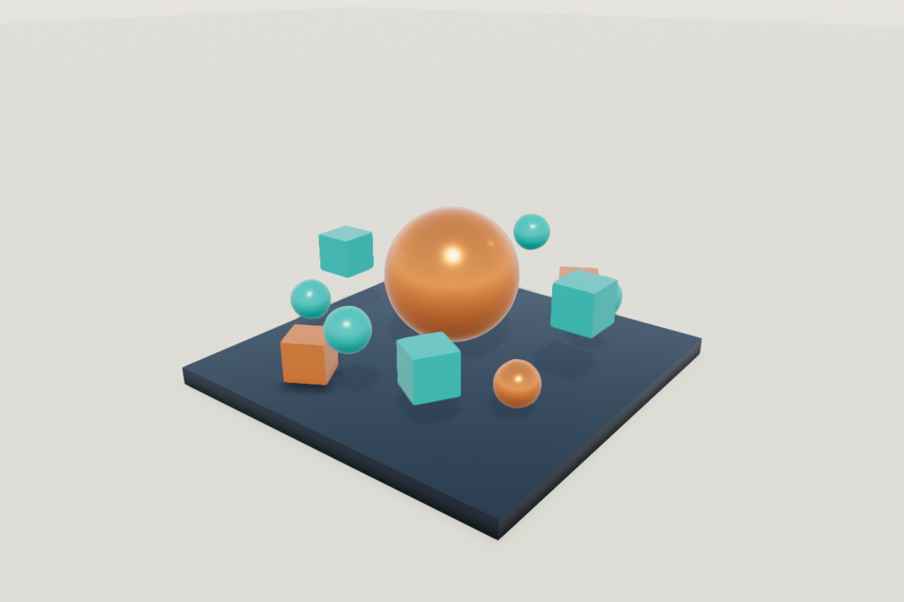

# sengine

A C++23 game engine with a backend-neutral API.



- Entities, components, transform hierarchies and deferred world changes.
- Parallel jobs, typed assets, asynchronous loading and snapshot-preserving reloads.
- Input actions, recorded input, fixed-step clocks and scoped event subscriptions.
- Animation curves, pose blending, procedural meshes and perspective or orthographic cameras.
- glTF scenes, skeletal animation, morph targets, PBR materials, shadows and positional lights.
- Audio streams, text, images and immediate-mode drawing.

```sh
./tools/fetch_filament.sh
cmake -S . -B build -DCMAKE_TOOLCHAIN_FILE=cmake/clang_libcxx.cmake
cmake --build build
./build/sengine_gallery
```

Choose `sengine_window_backend=sdl` or `glfw`, and `sengine_graphics_api=opengl`, `vulkan` or `metal`. Defaults are SDL and OpenGL on Linux, SDL and Metal on macOS. Rendering uses Filament; audio uses SDL. Public headers expose neither.

Needs Clang with libc++, SDL3 3.2+, FreeType and libpng. GLFW builds also need GLFW 3.3+. Set `filament_root` for an existing Filament 1.77.1 SDK. Materials are compiled with its `matc` tool.

For the core alone:

```sh
cmake -S . -B build-core -Dsengine_graphics=OFF
cmake --build build-core
./build-core/sengine_orbit
```

Link `sengine::sengine` through `add_subdirectory` or an installed CMake package. CMake exports compile commands.

World changes and asset commits belong to their owning thread. Component references last until structural changes; asset snapshots retain their resource across reloads. Keep the window alive through renderer destruction, and the renderer alive through scene and HUD destruction. Construct a canvas with its window and HUD, and hold its `activate()` binding while drawing. Job pools drain queued work on destruction; callbacks must not destroy their own pool.
