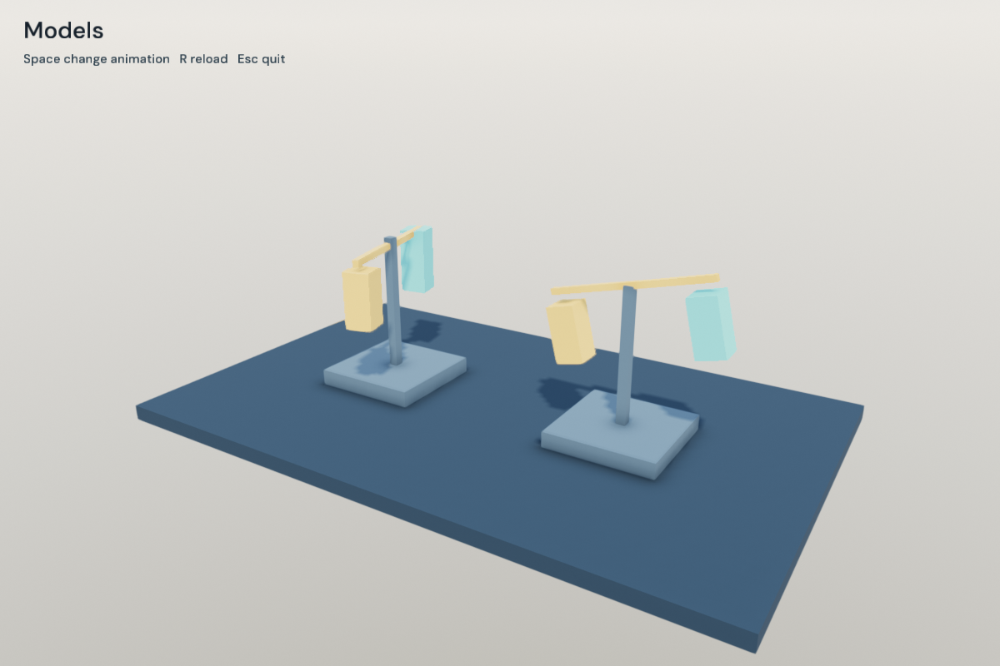

# sengine

A C++23 game engine.



```sh
./tools/fetch_filament.sh
cmake -S . -B build -DCMAKE_TOOLCHAIN_FILE=cmake/clang_libcxx.cmake
cmake --build build
./build/sengine_hello
```

Requires Clang with libc++, CMake 3.24+, SDL3 3.2+, FreeType and libpng.

Examples: [hello](examples/hello.cpp), [models](examples/models.cpp), [physics](examples/physics.cpp), [scenes](examples/scenes.cpp).
